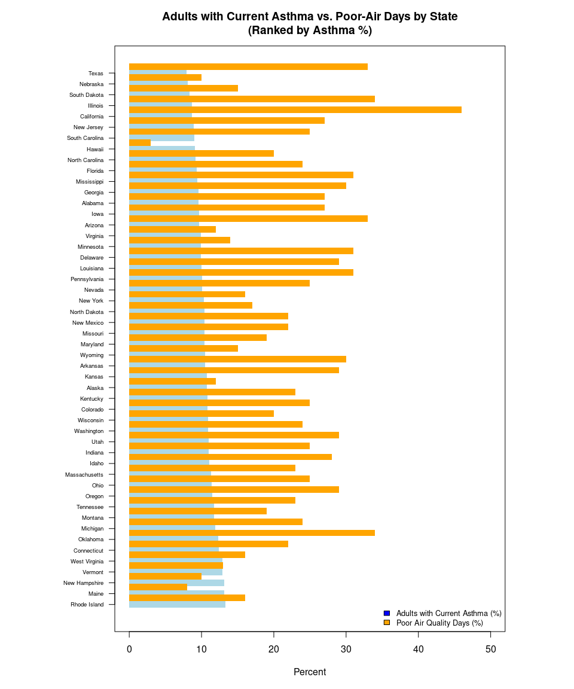

FinalRmarkdownproject
================
Jordyn Blauer
2025-11-12

- [ABSTRACT](#abstract)
- [BACKGROUND](#background)
- [STUDY QUESTION and HYPOTHESIS](#study-question-and-hypothesis)
  - [Questions](#questions)
  - [Hypothesis](#hypothesis)
  - [Prediction](#prediction)
- [METHODS/RESULTS](#methodsresults)
  - [1st Analysis](#1st-analysis)
  - [2nd Analysis](#2nd-analysis)
- [DISCUSSION](#discussion)
  - [Interpretation of 1st analysis](#interpretation-of-1st-analysis)
  - [Interpretation of 2nd analysis](#interpretation-of-2nd-analysis)
- [CONCLUSION](#conclusion)
- [REFERENCES](#references)

# ABSTRACT

# BACKGROUND

Asthma is a lung condition that causes difficulty in breathing due to
constricted airways in the lungs. There are many different kinds of
asthma such as; exercise-induced asthma, occupational asthma, and
allergy-induced asthma (Asthma). Those with occupational asthma can have
attacks triggered by things such as gases, fumes, and dust, similar to
that of air pollution (Asthma). Severity of the condition differs from
person to person with some only experiencing minor inconveniences while
others can experience debilitating and life-threatening challenges from
the disease (Asthma). Asthma is a very common disease in the U.S., about
28 million people in the U.S. suffer from asthma (Asthma facts).

Poor air quality can impact those who suffer from asthma by causing
their condition to worsen and trigger attacks (Tiotiu). It has been
found in epidemiological studies that greater levels of air pollution
has been associated with childhood asthma and that following an
improvement of air quality, childhood asthma incidence had lowered
(Jama). The state with the worst air quality in the U.S. is California
due to it’s high air pollution.

The graph shown below “Adults with Current Asthma vs Poor-Air Quality
Days by State (Ranked by Asthma %),” shows that the state that has the
highest prevalence of asthma in adults is California. Due to this, it is
believed that air quality can affect the prevalence of asthma per state.
We hypothesize that states that have a higher amounts of poor air
quality days will have a higher prevalence of asthma. We predict that
California will have the most poor air quality days and because of that
they will also have the highest rates of asthma compared to other
states.

``` r
# Load the data
air_data <- data.frame(
  State = c("Alabama", "Alaska", "Arizona", "Arkansas", "California", "Colorado", "Connecticut", "Delaware", "Florida", "Georgia", "Hawaii", "Idaho", "Illinois", "Indiana", "Iowa", "Kansas", "Kentucky", "Louisiana", "Maine", "Maryland", "Massachusetts", "Michigan", "Minnesota", "Mississippi", "Missouri", "Montana", "Nebraska", "Nevada", "New Hampshire", "New Jersey", "New Mexico", "New York", "North Carolina", "North Dakota", "Ohio", "Oklahoma", "Oregon", "Pennsylvania", "Rhode Island", "South Carolina", "South Dakota", "Tennessee", "Texas", "Utah", "Vermont", "Virginia", "Washington", "West Virginia", "Wisconsin", "Wyoming"),
  Poor_Air = c(0.27, 0.12, 0.33, 0.3, 0.46, 0.25, 0.22, 0.31, 0.24, 0.3, 0.03, 0.28, 0.34, 0.25, 0.27, 0.29, 0.23, 0.29, 0.08, 0.19, 0.23, 0.24, 0.14, 0.31, 0.22, 0.19, 0.1, 0.25, 0.1, 0.27, 0.22, 0.16, 0.2, 0.17, 0.25, 0.34, 0.29, 0.31, 0.16, 0.25, 0.15, 0.23, 0.33, 0.29, 0.13, 0.12, 0.24, 0.16, 0.2, 0.15),
  Asthma = c(9.6, 10.7, 9.7, 10.5, 8.7, 10.8, 12.4, 9.9, 9.3, 9.6, 9.1, 11.1, 8.7, 11, 9.7, 10.7, 10.8, 10, 13.1, 10.4, 11.3, 11.9, 9.9, 9.4, 10.4, 11.7, 8.1, 10.1, 13.1, 8.9, 10.4, 10.3, 9.2, 10.4, 11.4, 12.3, 11.5, 10.1, 13.3, 9, 8.3, 11.7, 7.9, 11, 12.9, 9.9, 10.9, 12.9, 10.9, 10.5)
)
```

``` r
# Use the existing air_data from our environment
# Convert to appropriate format and calculate percentages
df <- data.frame(
  State = air_data$State,
  asthma_pct = air_data$Asthma,
  poor_air_pct = air_data$Poor_Air * 100  # Convert proportion to percentage
)

# Sort by asthma percentage (descending)
df <- df[order(-df$asthma_pct), ]

# Set up plotting parameters
par(mar = c(5, 10, 4, 6))  # Adjust margins for state names
y_pos <- 1:nrow(df)  # Y positions for bars

# Create empty plot
plot(0, 0, type = "n", 
     xlim = c(0, 50), 
     ylim = c(0.5, nrow(df) + 0.5),
     xlab = "Percent", 
     ylab = "",
     main = "Adults with Current Asthma vs. Poor-Air Days by State\n(Ranked by Asthma %)",
     yaxt = "n")  # No default y-axis

# Add asthma bars (blue)
barplot_height <- df$asthma_pct
rect(xleft = 0, ybottom = y_pos - 0.3, 
     xright = barplot_height, ytop = y_pos + 0.3,
     col = "lightblue", border = NA)

# Add air quality bars (red) - offset slightly
barplot_height_air <- df$poor_air_pct
rect(xleft = 0, ybottom = y_pos - 0.3 + 0.6, 
     xright = barplot_height_air, ytop = y_pos + 0.3 + 0.6,
     col = "lightcoral", border = NA)

# Add state names
axis(2, at = y_pos, labels = df$State, las = 1, cex.axis = 0.6)

# Add legend
legend("bottomright", 
       legend = c("Adults with Current Asthma (%)", "Poor Air Quality Days (%)"),
       fill = c("lightblue", "lightcoral"),
       cex = 0.8,
       bty = "n")
```

<figure>

<figcaption aria-hidden="true">Adults with Current Asthma vs. Poor-Air
Days by State (ranked by Asthma %)</figcaption>
</figure>

# STUDY QUESTION and HYPOTHESIS

## Questions

Does air quality effect the prevalence of asthma per state?

## Hypothesis

The states with the highest amounts of poor air quality days will also
have higher prevalence of asthma.

## Prediction

California will have the highest prevalence of asthma because of its’
high amounts of poor air quality days.

# METHODS/RESULTS

## 1st Analysis

``` r
## 1st Analysis: Linear Regression - Air Quality vs Asthma Rates

# Scatter plot with regression line
plot(air_data$Poor_Air, air_data$Asthma,
     xlab = "Proportion of Poor Air Quality Days",
     ylab = "Asthma Rate (%)",
     main = "Air Quality vs Asthma Rates by State",
     pch = 16, col = "blue", cex = 1.2)

# Add regression line
model <- lm(Asthma ~ Poor_Air, data = air_data)
abline(model, col = "red", lwd = 2)

# Calculate statistics
correlation <- cor(air_data$Poor_Air, air_data$Asthma)
r_squared <- summary(model)$r.squared
p_value <- summary(model)$coefficients[2,4]

# Create comprehensive results table
regression_stats <- data.frame(
  Statistic = c("Correlation Coefficient", "R-squared", "Adjusted R-squared", 
                "Overall Model p-value", "Regression p-value", "Observations"),
  Value = c(round(correlation, 3),
            round(r_squared, 3),
            round(summary(model)$adj.r.squared, 3),
            round(pf(summary(model)$fstatistic[1], summary(model)$fstatistic[2], 
                     summary(model)$fstatistic[3], lower.tail = FALSE), 4),
            round(p_value, 4),
            nrow(air_data))
)

# Display model statistics
knitr::kable(regression_stats, caption = "Linear Regression Model Summary")
```

| Statistic               |   Value |
|:------------------------|--------:|
| Correlation Coefficient | -0.2790 |
| R-squared               |  0.0780 |
| Adjusted R-squared      |  0.0590 |
| Overall Model p-value   |  0.0497 |
| Regression p-value      |  0.0497 |
| Observations            | 50.0000 |

Linear Regression Model Summary

``` r
# Create coefficients table
coefficients_table <- data.frame(
  Term = c("Intercept", "Poor Air Quality"),
  Estimate = c(round(coef(model)[1], 3), round(coef(model)[2], 3)),
  Std_Error = c(round(summary(model)$coefficients[1,2], 3), 
                round(summary(model)$coefficients[2,2], 3)),
  t_value = c(round(summary(model)$coefficients[1,3], 3), 
              round(summary(model)$coefficients[2,3], 3)),
  p_value = c(round(summary(model)$coefficients[1,4], 4), 
              round(summary(model)$coefficients[2,4], 4))
)

knitr::kable(coefficients_table, caption = "Regression Coefficients")
```

|             | Term             | Estimate | Std_Error | t_value | p_value |
|:------------|:-----------------|---------:|----------:|--------:|--------:|
| (Intercept) | Intercept        |   11.560 |     0.554 |  20.873 |  0.0000 |
| Poor_Air    | Poor Air Quality |   -4.592 |     2.281 |  -2.013 |  0.0497 |

Regression Coefficients

``` r
# Add clean statistics to plot
legend("topright", 
       legend = c(paste("r =", round(correlation, 3)),
                  paste("R² =", round(r_squared, 3)),
                  paste("p =", ifelse(p_value < 0.001, "< 0.001", round(p_value, 3)))),
       bty = "n", cex = 0.9)
```

<!-- -->

## 2nd Analysis

``` r
## 2nd Analysis: T-test comparing asthma rates between high and low pollution states

# Create a new variable for pollution level based on the median of Poor_Air
air_data$Pollution_Level <- ifelse(air_data$Poor_Air > median(air_data$Poor_Air), "High", "Low")
air_data$Pollution_Level <- factor(air_data$Pollution_Level)

# Perform an independent two-sample t-test
t_test_result <- t.test(Asthma ~ Pollution_Level, data = air_data)

# Calculate group means
group_means <- tapply(air_data$Asthma, air_data$Pollution_Level, mean)

# Create a results table
results_table <- data.frame(
  Statistic = c("High Pollution Mean", "Low Pollution Mean", 
                "t-statistic", "p-value", "95% CI Lower", "95% CI Upper"),
  Value = c(round(group_means["High"], 2),
            round(group_means["Low"], 2),
            round(t_test_result$statistic, 3),
            round(t_test_result$p.value, 4),
            round(t_test_result$conf.int[1], 3),
            round(t_test_result$conf.int[2], 3))
)

# Display the table
knitr::kable(results_table, caption = "T-Test Results: Asthma Rates by Pollution Level")
```

| Statistic           |   Value |
|:--------------------|--------:|
| High Pollution Mean | 10.0700 |
| Low Pollution Mean  | 10.8800 |
| t-statistic         | -2.2740 |
| p-value             |  0.0276 |
| 95% CI Lower        | -1.5300 |
| 95% CI Upper        | -0.0940 |

T-Test Results: Asthma Rates by Pollution Level

``` r
# Create a boxplot to visualize the difference
boxplot(Asthma ~ Pollution_Level, 
        data = air_data,
        main = "Asthma Rates by Pollution Level",
        xlab = "Pollution Level", 
        ylab = "Asthma Rate (%)",
        col = c("lightgreen", "salmon"))
```

<!-- -->

``` r
# Load libraries
library(ggplot2)
library(patchwork)  # for combining plots side-by-side

# Read the data
data <- read.csv("Group Project CompBio - Summarized Sheet (combined counties).csv")

# Inspect column names if needed
names(data)
```

    ## [1] "State"                              "Percent.of..poor.air.quality..days"
    ## [3] "Percent.Adults.with.Current.Asthma"

``` r
# Rename columns to simpler names
names(data)[grep("poor.air.quality", names(data))] <- "PoorAirQuality"
names(data)[grep("Asthma", names(data))] <- "Asthma"

# Convert to numeric, in case they're text
data$PoorAirQuality <- as.numeric(gsub("[^0-9\\.]", "", data$PoorAirQuality))
data$Asthma <- as.numeric(gsub("[^0-9\\.]", "", data$Asthma))

# -------------------------
# 1️⃣ Histogram for Poor Air Quality (density)
p1 <- ggplot(data, aes(x = PoorAirQuality)) +
  geom_histogram(aes(y = ..density..), binwidth = 5,
                 fill = "lightgreen", color = "black", alpha = 0.7) +
  labs(
    title = "Distribution of Poor Air Quality Days",
    x = "Percent of Poor Air Quality Days",
    y = "Density"
  ) +
  theme_minimal()

# -------------------------
# 2️⃣ Histogram for Asthma (density)
p2 <- ggplot(data, aes(x = Asthma)) +
  geom_histogram(aes(y = ..density..), binwidth = 0.5,
                 fill = "skyblue", color = "black", alpha = 0.7) +
  labs(
    title = "Distribution of Adult Asthma Prevalence",
    x = "Percent of Adults with Current Asthma",
    y = "Density"
  ) +
  theme_minimal()

# -------------------------
# Combine side-by-side
p1 + p2
```

    ## Warning: The dot-dot notation (`..density..`) was deprecated in ggplot2 3.4.0.
    ## ℹ Please use `after_stat(density)` instead.
    ## This warning is displayed once every 8 hours.
    ## Call `lifecycle::last_lifecycle_warnings()` to see where this warning was
    ## generated.

<!-- -->

# DISCUSSION

## Interpretation of 1st analysis

## Interpretation of 2nd analysis

# CONCLUSION

# REFERENCES

1.  ChatGPT. OpenAI, version Jan 2025. Used as a reference for functions
    such as plot() and to correct syntax errors. Accessed 2025-11-12.

2.  Google. (2025). Gemini (version Oct 2025). Tool used for quick
    fixes, editing grammar and flow of text, and checking all rubric
    requirements were met.

3.  “Asthma.” Mayo Clinic, Mayo Foundation for Medical Education and
    Research, 8 Mar. 2025,
    www.mayoclinic.org/diseases-conditions/asthma/symptoms-causes/syc-20369653.

4.  Tiotiu AI, Novakova P, Nedeva D, Chong-Neto HJ, Novakova S,
    Steiropoulos P, Kowal K. Impact of Air Pollution on Asthma Outcomes.
    Int J Environ Res Public Health. 2020 Aug 27;17(17):6212. doi:
    10.3390/ijerph17176212. PMID: 32867076; PMCID: PMC7503605.

5.  “Jama Network \| Home of Jama and the Specialty Journals of the
    American Medical Association.” Jama Network, jamanetwork.com/.
    Accessed 12 Nov. 2025.

6.  “Asthma Facts.” Asthma & Allergy Foundation of America, 23
    Apr. 2025, aafa.org/asthma/asthma-facts/.
