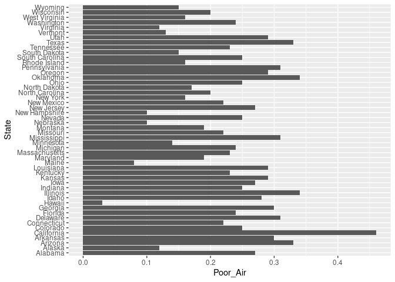

Rmarkdown Final Project
================
Jordyn Blauer
2025-10-30

- [ABSTRACT](#abstract)
- [BACKGROUND](#background)
- [STUDY QUESTION and HYPOTHESIS](#study-question-and-hypothesis)
  - [Questions](#questions)
  - [Hypothesis](#hypothesis)
  - [Prediction](#prediction)
- [METHODS](#methods)
  - [Fill in 1st analysis](#fill-in-1st-analysis)
- [Second Analysis](#second-analysis)
  - [Fill in 2nd analysis/plot](#fill-in-2nd-analysisplot)
  - [Statisical Test Code](#statisical-test-code)
- [DISCUSSION](#discussion)
  - [Interpretation of 1st analysis](#interpretation-of-1st-analysis)
  - [Interpretation of 2nd analysis](#interpretation-of-2nd-analysis)
- [REFERENCES](#references)

# ABSTRACT

# BACKGROUND

# STUDY QUESTION and HYPOTHESIS

## Questions

Our study question is: “Does air quality have an effect on the amount of
deaths caused by asthma?”

## Hypothesis

Our hypothesis is: “California will be the worst for those with asthma
because it has the highest percentage of bad air quality.”

A possible visualization we could use for our data is a barplot.

## Prediction

# METHODS

## Fill in 1st analysis

``` r
Group=read.csv("Group Project CompBio - Sheet1 (1).csv")
```

\##gallery code

``` r
# Load ggplot2
library(ggplot2)

# Create data
data <- data.frame(
  name=c("A","B","C","D","E") ,  
  value=c(3,12,5,18,45)
  )

# Barplot
ggplot(data, aes(x=name, y=value)) + 
  geom_bar(stat = "identity")
```

\##gallery code with our data

``` r
# library
library(ggplot2)
 
# Load the data
air_data <- data.frame(State = c("Alabama", "Alaska", "Arizona", "Arkansas", "California", "Colorado", "Connecticut", "Delaware", "Florida", "Georgia", "Hawaii", "Idaho", "Illinois", "Indiana", "Iowa", "Kansas", "Kentucky", "Louisiana", "Maine", "Maryland", "Massachusetts", "Michigan", "Minnesota", "Mississippi", "Missouri", "Montana", "Nebraska", "Nevada", "New Hampshire", "New Jersey", "New Mexico", "New York", "North Carolina", "North Dakota", "Ohio", "Oklahoma", "Oregon", "Pennsylvania", "Rhode Island", "South Carolina", "South Dakota", "Tennessee", "Texas", "Utah", "Vermont", "Virginia", "Washington", "West Virginia", "Wisconsin", "Wyoming"))
```

``` r
# Load ggplot2
library(ggplot2)

# Create data
data <- data.frame(
  Asthma = c(9.6, 10.7, 9.7, 10.5, 8.7, 10.8, 12.4, 9.9, 9.3, 9.6, 9.1, 11.1, 8.7, 11, 9.7, 10.7, 10.8, 10, 13.1, 10.4, 11.3, 11.9, 9.9, 9.4, 10.4, 11.7, 8.1, 10.1, 13.1, 8.9, 10.4, 10.3, 9.2, 10.4, 11.4, 12.3, 11.5, 10.1, 13.3, 9, 8.3, 11.7, 7.9, 11, 12.9, 9.9, 10.9, 12.9, 10.9, 10.5), 
  Poor_Air = c(0.27, 0.12, 0.33, 0.3, 0.46, 0.25, 0.22, 0.31, 0.24, 0.3, 0.03, 0.28, 0.34, 0.25, 0.27, 0.29, 0.23, 0.29, 0.08, 0.19, 0.23, 0.24, 0.14, 0.31, 0.22, 0.19, 0.1, 0.25, 0.1, 0.27, 0.22, 0.16, 0.2, 0.17, 0.25, 0.34, 0.29, 0.31, 0.16, 0.25, 0.15, 0.23, 0.33, 0.29, 0.13, 0.12, 0.24, 0.16, 0.2, 0.15))

State = c("Alabama", "Alaska", "Arizona", "Arkansas", "California", "Colorado", "Connecticut", "Delaware", "Florida", "Georgia", "Hawaii", "Idaho", "Illinois", "Indiana", "Iowa", "Kansas", "Kentucky", "Louisiana", "Maine", "Maryland", "Massachusetts", "Michigan", "Minnesota", "Mississippi", "Missouri", "Montana", "Nebraska", "Nevada", "New Hampshire", "New Jersey", "New Mexico", "New York", "North Carolina", "North Dakota", "Ohio", "Oklahoma", "Oregon", "Pennsylvania", "Rhode Island", "South Carolina", "South Dakota", "Tennessee", "Texas", "Utah", "Vermont", "Virginia", "Washington", "West Virginia", "Wisconsin", "Wyoming")

# Barplot
ggplot(data, aes(x=Poor_Air, y=State)) + 
  geom_bar(stat = "identity")
```

<!-- -->

# Second Analysis

## Fill in 2nd analysis/plot

## Statisical Test Code

\`\`\`

# DISCUSSION

## Interpretation of 1st analysis

## Interpretation of 2nd analysis

# REFERENCES
