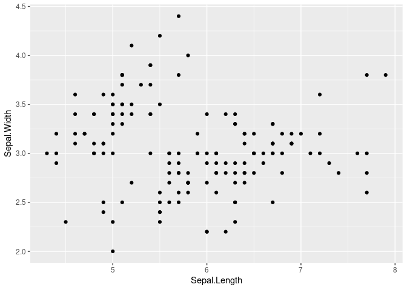

Rmarkdown Final Project
================
Jordyn Blauer
2025-10-30

- [ABSTRACT](#abstract)
- [BACKGROUND](#background)
- [STUDY QUESTION and HYPOTHESIS](#study-question-and-hypothesis)
  - [Questions](#questions)
  - [Hypothesis](#hypothesis)
  - [Prediction](#prediction)
- [METHODS](#methods)
  - [Fill in 1st analysis](#fill-in-1st-analysis)
  - [Barplot Code](#barplot-code)
- [Second Analysis](#second-analysis)
  - [Fill in 2nd analysis/plot](#fill-in-2nd-analysisplot)
  - [Statisical Test Code](#statisical-test-code)
- [DISCUSSION](#discussion)
  - [Interpretation of 1st analysis](#interpretation-of-1st-analysis)
  - [Interpretation of 2nd analysis](#interpretation-of-2nd-analysis)
- [REFERENCES](#references)

# ABSTRACT

# BACKGROUND

# STUDY QUESTION and HYPOTHESIS

## Questions

Our study question is: “Does air quality have an effect on the amount of
deaths caused by asthma?”

## Hypothesis

Our hypothesis is: “California will be the worst for those with asthma
because it has the highest percentage of bad air quality.”

A possible visualization we could use for our data is a scatterplot.

## Prediction

# METHODS

## Fill in 1st analysis

``` r
Group=read.csv("Group Project CompBio - Sheet1.csv")
```

\##gallery code

``` r
# library
library(ggplot2)
 
# The iris dataset is provided natively by R
#head(iris)
 
# basic scatterplot
ggplot(iris, aes(x=Sepal.Length, y=Sepal.Width)) + 
    geom_point()
```

<!-- -->

\##gallery code with our data

``` r
# library
library(ggplot2)
 
# basic scatterplot
ggplot(Group, aes(x=Average.proportion.per.state, y=State)) + 
    geom_point()
```

## Barplot Code

# Second Analysis

## Fill in 2nd analysis/plot

## Statisical Test Code

\`\`\`

# DISCUSSION

## Interpretation of 1st analysis

## Interpretation of 2nd analysis

# REFERENCES
